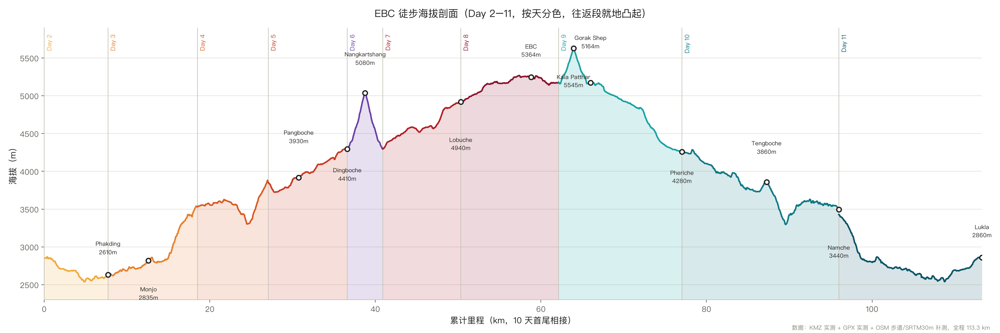

# EBC 徒步行前调研报告（2026-09-25 → 2026-10-06）

行程硬约束：9 月 25 日上午 11:00 落地加德满都，当天出发进山；10 月 6 日晚上回到加德满都；10 月 7 日早上飞回上海。山上共 12 天。轻装徒步，驼包交给背夫，沿途住茶屋，自带睡袋。

本报告的每个事实都标注了出处，出处原文存放在 `sources/` 目录。表格数据以 `data/` 目录下的 CSV 文件为准，报告中的表格是这些 CSV 的引用视图。

## 0. 结论速览

| 事项 | 结论 | 出处 |
|---|---|---|
| 签证 | 落地签，中国公民免费，选 30 天停留期 | sources/01 |
| 9.25 当天进山 | 只有一个可行选项：提前包一架直升机，下午从加德满都直飞 Lukla。旺季固定翼全部改从 Ramechhap 起飞且只飞上午，当天赶不上 | sources/02、03 |
| 许可证 | 两个：Sagarmatha 国家公园门票 + Khumbu 市政证，各 NPR 3,000，都能在进山路上办 | sources/04 |
| 向导 | 法规上 Khumbu 地区允许不请向导；综合保险条款、旺季订房、突发处置三个因素，建议请一名，两人分摊后每人 ¥1,020–1,836 | sources/05、08 |
| 背夫 | 一名背夫背两个人的驼包，可以在 Lukla 现场雇；旺季人手紧张，建议提前订好、约在 Lukla 会合 | sources/05 |
| 保险 | 必买覆盖 6,000 米海拔和直升机救援的产品。大部分国内在售旅行险的海拔上限卡在 5,000–5,500 米，买之前逐条核对条款 | sources/08 |
| 必要开销总价 | 2 人组：每人约 ¥17,000–23,800；4–5 人组：每人约 ¥11,220–17,680。国际机票和个人装备不计入 | data/cost-breakdown.csv |
| 最大风险 | 10.6 从 Lukla 飞出这一段没有缓冲日。天气取消航班时，要立刻改乘直升机（每人 ¥3,400–4,760）才能保住 10.7 的国际航班，这笔钱要预留 | sources/02、03 |

## 1. 签证

| 项目 | 内容 | 出处 |
|---|---|---|
| 类型 | 落地签（Visa on Arrival），加德满都特里布万国际机场（TIA）入境大厅办理 | 尼泊尔驻北京大使馆官网（sources/01） |
| 费用 | 中国公民免签证费。其他国籍按时长收 RMB 225–950，中国护照全免 | 同上 |
| 停留期 | 15 / 30 / 90 天三档，均为多次入境。本行程选 30 天 | 同上 |
| 材料 | 有效期 6 个月以上的护照、35×45mm 证件照、往返机票与酒店预订证明 | 同上 |
| 中国边检出境 | 尼泊尔在中国官方认可的落地签名单内。凭有效护照和往返机票行程单即可出境，白本护照可以放行 | 中国领事服务网（sources/01） |
| 流程 | 飞机上空乘发出入境卡；落地后填表、在自助机拍照、走 gratis visa（免费签证）柜台 | 知乎落地签流程实录（sources/01） |
| 注意 | 落地签只适用于从加德满都机场或印度口岸入境；从西藏陆路口岸进入尼泊尔享受不到这个政策。你们坐飞机入境，不受影响 | 同上 |

## 2. 进出山交通

### 2.1 背景事实

尼泊尔民航局（CAAN）规定：春季（3–5 月）和秋季（9–11 月）两个旺季，所有飞 Lukla 的固定翼航班从 Ramechhap 的 Manthali 机场起降，加德满都不发固定翼航班。上一个秋季的切换日期是 9 月 25 日。加德满都到 Manthali 车程 4–5 小时，航班只在上午 6:00–11:00 的目视飞行窗口内运行。（sources/02）

直升机在旺季照常从加德满都国内机场直飞 Lukla，飞行时间约 45 分钟。拼机每人 ¥3,400–4,760，包机每架 ¥19,720–23,800、最多坐 5 人（按总重量核定，预订时要报体重）。常规拼机班次都排在早上；下午没有定期班次，包机在天气允许时可以飞，但午后云量上升，取消概率高于上午。（sources/03）

### 2.2 你们的方案

| 段 | 方案 | 价格 | 出处 |
|---|---|---|---|
| 9.25 进山 | 提前包一架直升机，约定 14:00–15:00 从加德满都国内航站起飞直达 Lukla。11:00 落地后办落地签、取行李、转国内航站，时间刚好衔接 | 包机 ¥19,720–23,800/架，2 人分摊每人 ¥9,860–11,900；4 人每人 ¥4,930–5,950；5 人每人 ¥3,944–4,760 | sources/03 |
| 10.6 出山 | Lukla 早班固定翼飞 Manthali，落地后拼车回加德满都，傍晚到 | 机票 ¥1,190–1,292 + 拼车 ¥204 | sources/02 |
| 10.6 兜底 | 固定翼因天气取消时，立刻改直升机直飞加德满都 | 拼机每人 ¥3,400–4,760，这笔钱作为预备金，不动用就不花 | sources/03 |

两点提醒：

1. 你们提到的「¥3,400 的小飞机」，对应的是固定翼往返总价（旺季经 Ramechhap 往返约 ¥3,482）。它解决不了 9.25 当天进山的问题：航班只在上午飞，而且要先坐 4–5 小时车到 Ramechhap。
2. 9.25 下午的包机存在天气风险。9 月底是雨季的尾巴，午后山区容易起云。预订时把「11:00 落地 TIA、下午飞 Lukla」的衔接需求明确告诉运营商，并谈好当天飞不成时顺延到 9.26 早上的改期条款。9.26 早上飞的备选行程见第 5 节末尾。

## 3. 许可证（两个证）

| 证件 | 费用 | 办理地点 | 材料 | 出处 |
|---|---|---|---|---|
| Khumbu Pasang Lhamu Rural Municipality 市政证 | NPR 3,000（2025 年从 2,000 上调，部分旧攻略的数字已过期） | 只能在 Lukla 镇尾的市政检查站或 Monjo 办理，加德满都办不了 | 护照 | sources/04 |
| Sagarmatha National Park 国家公园门票 | NPR 3,000（外国人价） | Monjo 公园门口，或提前在加德满都 Nepal Tourism Board 办 | 护照，建议带 2 张证件照备用 | sources/04 |

两个证合计 NPR 6,000，约 ¥306。TIMS 卡在 Khumbu 地区不需要办。你们直飞 Lukla，两个证都在进山路上顺路办：D1 在 Lukla 办市政证，D2 路过 Monjo 办公园门票。（sources/04）

## 4. 向导与背夫

### 4.1 是否必须请向导

尼泊尔 2023 年 4 月起在全国推行强制向导规定，但 Khumbu 地区（整条 EBC 主线）由地方市政自治，主动退出了这项规定。两个独立来源（其中一个更新于 2026 年 1 月 8 日）确认：独立徒步者只需持两个许可证即可通行，检查站不查向导。个别 2026 年的网页声称豁免即将收紧，与上述两个更具体的来源矛盾，本报告按豁免仍然有效处理，建议出发前一个月再核实一次。（sources/05）

法规之外，有三个因素支持请一名向导：

1. **保险条款**：World Nomads 承保到 6,000 米的前提是随行有合格向导。保险决策和向导决策绑在一起（见第 7 节）。（sources/08）
2. **旺季订房**：10 月初是全年最挤的时段，Tengboche、Gorak Shep 等站点床位紧张，向导会提前打电话逐站订房。（sources/07）
3. **突发处置**：高原反应恶化时，向导负责联络直升机救援和与保险公司对接。第 7 节的救援理赔案例里，报案和协调都由当地代理完成。（sources/08）

### 4.2 价格与雇佣方式

| 角色 | 日薪（含其本人食宿、保险） | 12 天合计 | 2 人分摊后每人 | 出处 |
|---|---|---|---|---|
| 持证向导 | ¥170–306/天 | ¥2,040–3,672 | ¥1,020–1,836 | sources/05 |
| 背夫 | ¥122–204/天 | ¥1,469–2,448 | ¥734–1,224 | sources/05 |
| 小费 | 全程一次性 | — | 约 ¥680/人（中文完整攻略实报数；英文来源建议按工资的 10–15%，两者量级一致） | sources/07 |

雇佣方式的结论：

- **背夫可以到 Lukla 现场雇**，机场出口就有背夫在揽客，这是成熟做法。一名背夫背两个人的驼包，负重上限 20–25kg，即每人驼包控制在 10–12kg 以内。（sources/05）
- **旺季到现场再雇，有风险**。10 月人手紧张，现场雇可能要等，也没有机会核验对方的服务质量。多个来源建议提前通过加德满都的正规代理订好，约在 Lukla 会合，这样还能省掉向导和背夫从加德满都飞进山的机票（单程 ¥1,224–1,496/人）。（sources/05）
- 建议动作：出发前 1–2 个月联系代理，订「1 向导 + 1 背夫，Lukla 会合」，同时把沿途订房委托给向导。

## 5. 12 天路线

完整逐日数据在 `data/itinerary.csv`（日期、区段、里程、海拔、茶屋、三餐、单日花费、注意事项），以下是浓缩视图。里程与海拔的主要出处是 Earth Trekkers 的逐日实测记录（sources/06，作者走的季节与你们相同），距离一栏同时给出 GPX 轨迹的计算值作对照。

| 天 | 日期 | 行程 | 里程 km | 海拔变化 | 宿 | 海拔 m |
|---|---|---|---|---|---|---|
| 1 | 9.25 | 加德满都 →（包机）Lukla → Phakding | 7.8（GPX 8.6） | 2860 → 2610 | Phakding | 2,610 |
| 2 | 9.26 | Phakding → Monjo（办证）→ Namche | 10.4（GPX 10.9） | +830 | Namche Bazaar | 3,440 |
| 3 | 9.27 | Namche 适应日：往返 Everest View Hotel（3,880m） | 3–5 | +440 往返 | Namche Bazaar | 3,440 |
| 4 | 9.28 | Namche → Tengboche | 9.0 | +430（先下河谷再爬 600） | Tengboche | 3,860 |
| 5 | 9.29 | Tengboche → Dingboche | 10.7（GPX 11.2） | +540 | Dingboche | 4,410 |
| 6 | 9.30 | Dingboche 适应日：Nangkartshang 山脊（约 5,080m） | 4–6 | +500 往返 | Dingboche | 4,410 |
| 7 | 10.1 | Dingboche → Dughla → Lobuche | 9.7（GPX 9.6） | +530 | Lobuche | 4,940 |
| 8 | 10.2 | Lobuche → Gorak Shep → **EBC 5,364m** → 返 Gorak Shep | 11.3（GPX 12.3） | +440 | Gorak Shep | 5,164 |
| 9 | 10.3 | 凌晨 **Kala Patthar 5,545m** 看日出 → 下撤 Pheriche | 16–18 | +380 / −1,265 | Pheriche | 4,280 |
| 10 | 10.4 | Pheriche → Tengboche → Namche | 15–20 | −840 | Namche Bazaar | 3,440 |
| 11 | 10.5 | Namche → Lukla | 18.2（GPX 19.5） | −580 | Lukla | 2,860 |
| 12 | 10.6 | Lukla →（固定翼）Manthali →（拼车）加德满都 | — | — | Thamel | 1,400 |

海拔剖面图（由 GPX 轨迹生成，单程 58.3 km，往返约 117 km；文献口径的「约 130 km」把适应日徒步和 Kala Patthar 支线也算了进去）：

- 轨迹文件：`assets/Everest_Base_Camp.gpx`（3,291 个带海拔的轨迹点，来源见 sources/11），逐村里程数据在 `data/route-track-stats.csv`。
- 行程结构上，这就是行业标准的 12 天走法：两个适应日（Namche、Dingboche）一个都不能省。Earth Trekkers 的同行者在 Kala Patthar 顶附近急性高反（眩晕、呕吐），快速下撤后缓解。这个案例是保留适应日的直接证据。（sources/06）
- 茶屋、三餐和单日花费的安排都在 `data/itinerary.csv` 里，茶屋名单来自 sources/07 汇总的推荐名录，热门站点请向导提前电话订房。
- 三餐的基本形态：早饭在茶屋吃粥、吐司加鸡蛋配奶茶；午饭在途中茶屋吃 dal bhat（米饭配豆汤和咖喱菜，主食可以续）或炒饭、汤面；晚饭回茶屋吃 dal bhat、momo（藏式饺子）或意面。低海拔单餐 ¥34–54，Gorak Shep 一带单餐 ¥68–102。（sources/06、07）

**备选行程（9.25 下午包机没飞成时启用）**：9.25 宿加德满都或 Lukla，9.26 早上飞 Lukla 后当天直接走到 Namche（约 19 km，爬升 1,200m，7–9 小时，对体能有要求）。这样 9.26 晚上就回到主计划的进度，两个适应日和 Kala Patthar 都保得住。第一晚睡 Lukla（2,860m）与主计划睡 Phakding（2,610m）海拔相差 250m，对适应节奏影响很小。

## 6. 装备清单（针对零装备起步）

完整清单在 `data/packing-list.csv`（33 项，含数量、优先级、放驼包还是随身、购买或租赁渠道）。这里列决策要点：

| 决策 | 结论 | 出处 |
|---|---|---|
| 睡袋 | 四季款、舒适温标 -10°C。茶屋提供毯子但高海拔不够暖，与你们对被子的判断一致。可以在加德满都 Thamel 租，¥7–14/天 | sources/09 |
| 厚羽绒服 | 必备，Lobuche 以上早晚用。Thamel 租 ¥7–20/天。这类用完即闲置的大件，租比买划算 | sources/09 |
| 徒步靴 | 必须在国内买好并提前 4 周以上磨合。全程最重要的单品，新靴直接上山大概率磨出水泡 | sources/09 |
| 穿衣体系 | 三层：速干底层（棉质不可）+ 抓绒中层 + 防风防水硬壳。逐件清单见 CSV | sources/09 |
| 头灯 | 必备：Kala Patthar 凌晨出发、茶屋停电、夜间上厕所都用它 | sources/09 |
| 净水 | 带净水片或过滤器。瓶装水越往上越贵（¥20–34/瓶），12 天能省 ¥680 以上 | sources/07 |
| 药品 | Diamox（乙酰唑胺，预防急性高山病的标准用药，行前咨询医生并试敏）、布洛芬、肠胃药、口服补液盐；推荐带指夹式血氧仪每天自查 | sources/09 |
| 重量约束 | 驼包每人 10–12kg 以内（背夫负重上限决定），固定翼托运限额也是 10kg + 手提 5kg | sources/05、09 |

## 7. 保险与其它必须考虑的事项

### 7.1 保险（必买，且要挑对产品）

直升机救援单次费用在数万元人民币量级，多个来源引用的上限是 ¥136,000–204,000（含后续医疗）。一个有据可查的实际理赔案例：尼泊尔徒步高反救援，直升机费用 22,327 元人民币，加医疗共 29,740 元，由「保游全球旅行保险」全额报销。（sources/08）

中国居民买保险的现实困难：EBC 有多个点位超过 5,500 米（Kala Patthar 5,545m），而大部分国内在售产品的海拔条款卡在这条线以下。已核实的情况：

| 产品 | 海拔条款 | 直升机救援 | 结论 | 出处 |
|---|---|---|---|---|
| World Nomads | 承保到 6,000m，**前提是随行有合格向导** | 覆盖紧急撤离 | 首选；下单前在官网把居住国选为中国，确认有可购买的计划 | sources/08 |
| 保游全球旅行保险 | 有尼泊尔高海拔救援的实际赔付案例 | 有实赔记录（2.2 万元救援费全报） | 可作为主选或备选 | sources/08 |
| 京东安联「环游四海」 | 承保 6,000m 以下 | 尼泊尔直升机救援限额 6,000 元人民币，单次救援缺口约 2 万元 | 只能作为组合件，缺口自担 | sources/08 |
| 平安「24 全球旅游保险」 | 援助方不承担 5,500m 以上的责任 | — | 不适用本行程 | sources/08 |
| 美亚 | 已无在售个人旅行险 | — | 不适用 | sources/08 |

选购时核对下面三点：急性病（高反、肺水肿）身故与医疗责任在保障范围内；海拔上限 ≥ 5,600m；紧急医疗运送限额 ≥ 30 万元人民币。另外，2026 年 4 月尼泊尔直升机骗保产业链被曝光后，保险公司对该地区的救援理赔收紧，救援时走保险公司指定的救援协调方、保留全部票据。（sources/08）

### 7.2 其它事项

| 事项 | 要点 | 出处 |
|---|---|---|
| 现金 | 在加德满都换好 NPR 50,000–80,000 随身带上山（约合每天 ¥272–340 的开销）。Namche 有两台 ATM 但缺钞、断网、吞卡常见，山上其他地方没有 ATM。带小面额。人民币在 Thamel 可以直接换，参考汇率 1 CNY ≈ 15 NPR。8264 中文攻略作者的教训：现金带少了，中途专门折返 Namche 取钱 | sources/07、10 |
| 通讯 | 机场或 Thamel 买 Ncell 或 NTC 的 SIM 卡（NPR 100–200）：Ncell 在 Lukla、Namche 一带信号好，NTC 整体覆盖更广。Namche 以上主要靠茶屋的 Everest Link WiFi 卡，参考价 10GB 约 ¥102 | sources/07 |
| 高反监控 | 每天早晚测血氧；头痛加重、呕吐、嗜睡是下撤信号，处置原则只有一条：降低海拔。你们的行程里 D9 从 Kala Patthar 当天下降 1,265m，是安全设计 | sources/06 |
| 天气窗口 | 9 月底是雨季向旱季过渡的尾巴，9.25 前后仍可能遇到降雨和午后起云；10 月初进入全年最稳定的窗口。这两点分别影响 9.25 的包机和 10.6 的返程航班 | sources/02、03 |
| 返程没有缓冲日 | 10.6 飞出、10.7 国际段。多个来源明确反对这种排法（旺季建议留 1–2 天缓冲），你们的日期定死了，能做的准备就是第 2.2 节的直升机预备金：每人预留 ¥3,400–4,760 额度，固定翼取消时当场改乘 | sources/02、03 |
| 订房 | 10 月初是全年最旺的两周，Gorak Shep、Tengboche 床位最紧张。委托向导逐站提前电话订房 | sources/05、07 |

## 8. 预估总价（必要开销，国际机票与个人装备不计入）

明细以 `data/cost-breakdown.csv` 为准（每行含单价、数量、分摊人数、出处），以下是引用视图。共享项（包机、向导、背夫、房间）按 2 人分摊计算：

| 类别 | 项目 | 每人低值 ¥ | 每人高值 ¥ | 备注 |
|---|---|---|---|---|
| 签证 | 落地签 30 天 | 0 | 0 | 中国公民免费 |
| 交通 | 9.25 直升机包机进山（÷2） | 9,860 | 11,900 | 4 人分摊 4,930–5,950；5 人 3,944–4,760 |
| 交通 | 10.6 固定翼 Lukla→Manthali | 1,190 | 1,292 | 旺季只从 Ramechhap 起降 |
| 交通 | 10.6 Manthali→加德满都拼车 | 204 | 204 | 4–5 小时 |
| 许可证 | 国家公园 + 市政证（NPR 6,000） | 306 | 306 | 进山路上办 |
| 人力 | 向导 12 天（÷2） | 1,020 | 1,836 | Lukla 会合省其机票 |
| 人力 | 背夫 12 天（÷2） | 734 | 1,224 | 一人背两个驼包 |
| 人力 | 小费 | 680 | 680 | 中文攻略实报数 |
| 食宿 | 茶屋房费 11 晚 | 374 | 748 | 基础双人间 |
| 食宿 | 三餐 12 天 | 1,632 | 2,856 | 高海拔单餐贵一倍 |
| 杂项 | 饮水、充电、热水澡、WiFi | 374 | 1,122 | 自带净水手段取低值 |
| 杂项 | SIM 卡与流量 | 34 | 136 | — |
| 保险 | 高海拔险含直升机救援 | 544 | 1,020 | 见第 7.1 节 |
| 市内 | 10.6 晚 Thamel 酒店（÷2） | 143 | 218 | 中档双人间 |
| 市内 | 机场往返出租 | 27 | 54 | 预付出租 |
| **合计** | **2 人组** | **17,122** | **23,596** | **报价口径：每人 ¥17,000–23,800** |

不计入总价、但要知道的三笔钱：

| 项目 | 每人 ¥ | 说明 |
|---|---|---|
| 装备租赁（睡袋 + 羽绒服，12 天） | 163–408 | 按你们的口径装备另算，列此供参考 |
| 10.6 直升机兜底预备金 | 3,400–4,760 | 不动用就不花，但额度要留出 |
| 备选：放弃 9.25 进山、改 9.26 早拼机 | 省 5,100–7,140 | 总价降到每人约 10,676–16,456，代价是启用备选行程 |

人数敏感度：包机、向导、背夫、房间四项随人数摊薄。4–5 人组的总价约为每人 ¥11,220–17,680。

## 9. 建议的行动清单（按时间倒排）

| 时间 | 动作 |
|---|---|
| 现在 → 8 月中 | 确定同行人数（直接决定包机分摊）；买保险前逐条核对海拔与救援条款；在国内买徒步靴开始磨合 |
| 8 月 | 联系加德满都代理：订 9.25 下午直升机包机（写明 11:00 落地 TIA 的衔接和顺延条款）、订「1 向导 + 1 背夫 Lukla 会合」、订 10.6 早班 Lukla→Manthali 机票 |
| 9 月上旬 | 备齐 `data/packing-list.csv` 上的自购项；行前咨询医生开 Diamox 并试敏 |
| 出发前 1 周 | 核实 Khumbu 向导豁免政策有没有变化（sources/05 的两个来源）；看 9 月底加德满都与 Khumbu 天气趋势 |
| 9.24 登机前 | 打印往返机票行程单和酒店订单（中国边检出境 + 落地签材料）；带 4 张证件照、护照复印件 2 份 |

## 10. 出处索引

| 文件 | 主题 | 核心来源 |
|---|---|---|
| sources/01-visa.md | 签证 | 尼泊尔驻北京大使馆、中国领事服务网、知乎流程实录 |
| sources/02-lukla-flight-fixed-wing.md | 固定翼航班与 Ramechhap | MountainKick、Seven Summit Treks（CAAN 通告）、多站票价 |
| sources/03-helicopter.md | 直升机 | Nepal Chopper、Himalayan Adventure Treks 等运营商 |
| sources/04-permits.md | 许可证 | Travel Himalaya Nepal、Himalayan Recreation、Magical Nepal |
| sources/05-guide-porter.md | 向导与背夫 | Travel Himalaya Nepal、Nepal Everest Base Camp（2026-01 更新）、Nepal Guide Info 等 |
| sources/06-route-itinerary-earthtrekkers.md | 逐日路线 | Earth Trekkers 实测记录 + 三个 12 天行程交叉验证 |
| sources/07-costs-lodging-food.md | 食宿物价、茶屋、现金、通讯 | Himalayan Hero、The Everest Holiday、茶屋名录汇总 |
| sources/08-insurance.md | 保险 | 知乎测评、保游网理赔案例、World Nomads、新浪财经 |
| sources/09-packing-gear-rental.md | 装备与租赁 | Follow Alice、Kandoo、Thamel 租赁价格汇总 |
| sources/10-chinese-guides.md | 中文完整攻略 | 8264 三万字攻略、Travel Arbitrage 2026 |
| sources/11-gpx-track.md | GPX 轨迹 | Real World Adventures（源自 outdooractive） |
| sources/12-kathmandu-city.md | 加德满都市内 | 酒店与机场交通价格汇总 |
